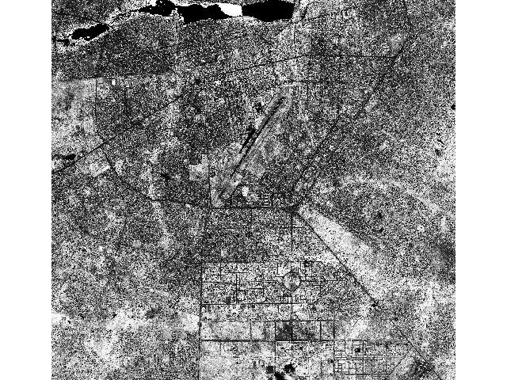
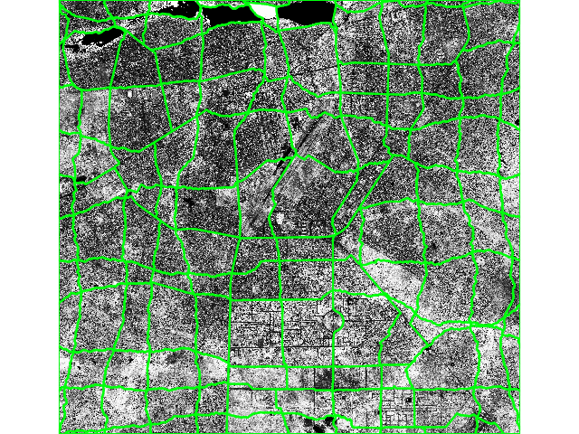

# Cutline generation
These scripts use different GRASS GIS modules to create cutlines / cutpolygons that allow to tile an image with irregular tiles taking into account the edges present in the image.

Here after, one example of what it could provide:
 
 